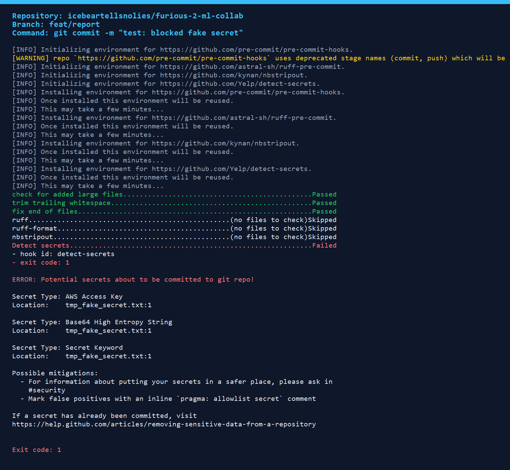
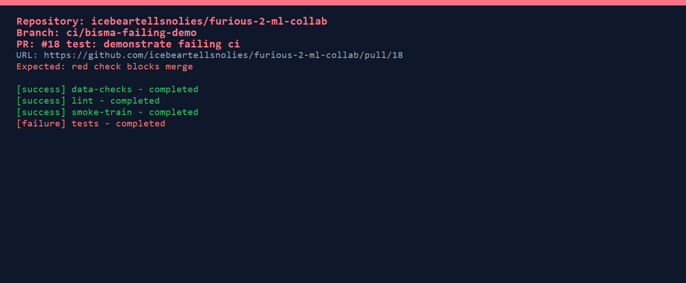
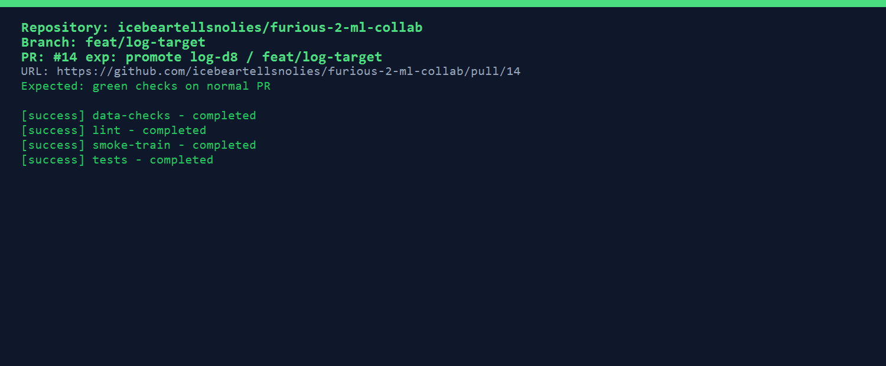

# REPORT: Furious-2 ML Collaboration (Online News Popularity)

Repository: https://github.com/icebeartellsnolies/furious-2-ml-collab
Release tag: `model-v1.0` on `main`

## 1. Team, roles, dataset

| Member | GitHub | Role |
|---|---|---|
| Naimah Rehman | [@icebeartellsnolies](https://github.com/icebeartellsnolies) | Data owner (DVC, data checks, dataset update); Platform owner (CI, pre-commit, releases) |
| Bisma Munir | [@Bisma474](https://github.com/Bisma474) | Model owner (pipeline, `params.yaml`, experiments); shared Platform work |

- **Dataset:** [Online News Popularity](https://archive.ics.uci.edu/dataset/332/online+news+popularity) (UCI; Kaggle mirror: <https://www.kaggle.com/datasets/deepakshende/onlinenewspopularity>). Task: regression on `shares`.
- **Starter code:** TODO (add the source link of the starter code that was imported in the initial commit `77056b6`).
- **DVC remote:** shared Google Drive folder (`.dvc/config`, no credentials committed).

## 2. Reproducibility table (released model `model-v1.0`)

| Item | Value |
|---|---|
| Release commit SHA (`main`, tag `model-v1.0`) | TODO (fill after tagging: `git rev-parse model-v1.0^{commit}`) |
| `commit_sha` logged in `metrics.json` | `8c801aeab9dfcd73ca47bf570146e784c9231760` (the code commit that produced the model, on `dev` via PR #14) |
| `seed` / `data.random_state` / `train.random_state` | 42 / 42 / 42 |
| `data.test_size` | 0.2 |
| `train.model_type`, `n_estimators`, `max_depth`, `log_target` | `random_forest`, 200, 8, `true` (fit on `log1p(shares)`, metrics on the original scale) |
| Data pointer `data/raw/dataset.csv.dvc` | md5 `3cda51300b152e82e02812fb772f37e2`, 21,479,227 bytes, 38,463 rows |
| Lock file | `dvc.lock` (model md5 `4f16d2ade3fc2f62d9e1c4d4994f3c3e`, train md5 `0e98d3fbde874e9678e5e41da28e929b`, test md5 `eff73d2c7d01845def72006435397d06`) and `uv.lock` (pinned environment) |
| Final metrics (`metrics.json`, 7,693 test rows) | **MAE 2303.8499, RMSE 12015.5376, R2 -0.0038** |

Reproduce (fresh clone):

```bash
git clone https://github.com/icebeartellsnolies/furious-2-ml-collab.git && cd furious-2-ml-collab
git checkout main        # or: git checkout model-v1.0
uv sync
uv run dvc pull
uv run dvc repro
cat metrics.json
```

Independent reproduction by the member who did not train the final model: see the release PR `dev` -> `staging` (section 4), where `metrics.json` is posted and matches the table above.

Note: `dvc.lock` md5s for files with line endings (for example `metrics.json`, `src/features.py`) can differ between Windows and Linux. Compare the metric values, not those md5s.

## 3. Experiments (`dvc exp show`) and why the winner was chosen

Baseline before tuning (depth 4, raw target): MAE 2969.13 (PR #10).

**Naimah**: branches [`exp/naimah-max-depth`](https://github.com/icebeartellsnolies/furious-2-ml-collab/tree/exp/naimah-max-depth) (abandoned, see section 6) and [`exp/naimah-log-target`](https://github.com/icebeartellsnolies/furious-2-ml-collab/tree/exp/naimah-log-target):

| Experiment | `max_depth` | `log_target` | MAE | RMSE | R2 |
|---|---:|---|---:|---:|---:|
| depth-6 | 6 | false | 2950.8118 | 11976.4317 | 0.0027 |
| depth-8 | 8 | false | 2953.7986 | 11995.7040 | -0.0005 |
| depth-10 | 10 | false | 2982.0904 | 12031.9347 | -0.0066 |
| log-d4 | 4 | true | 2329.7208 | 12031.1064 | -0.0065 |
| log-d6 | 6 | true | 2313.8741 | 12021.5365 | -0.0048 |
| **log-d8 (winner)** | 8 | true | **2303.8499** | 12015.5376 | -0.0038 |

**Bisma**: branch [`exp/bisma-rf-sweep`](https://github.com/icebeartellsnolies/furious-2-ml-collab/tree/exp/bisma-rf-sweep), baseline `dbc3e8c`:

| Experiment | `max_depth` | MAE | RMSE | R2 |
|---|---:|---:|---:|---:|
| bisma-depth4 | 4 | 2969.1332 | 11967.6409 | 0.0041 |
| bisma-depth8 | 8 | 2953.7986 | 11995.7040 | -0.0005 |
| bisma-depth10 | 10 | 2982.0904 | 12031.9347 | -0.0066 |

**Why log-d8 won.** Depth alone barely moves the error (best raw-target MAE 2950.8 vs 2969.1 at depth 4, about -0.6%). The target `shares` is heavily right-skewed; fitting on `log1p(shares)` cut MAE to 2303.85 (-22.4% vs the depth-4 baseline), and depth 8 was the best of the log runs. Decision rule: lowest MAE, because MAE is the metric the team reports. RMSE (+0.33% vs depth 6 raw) and R2 (about 0 for every run) did not improve, because RMSE is dominated by a few viral articles, so this tradeoff was accepted on purpose. Promoted via PR #14 (before and after table in its description).

## 4. Key PRs

| What | Link |
|---|---|
| Data-update PR (drop 1,181 empty-content rows; 39,644 -> 38,463) | [#12](https://github.com/icebeartellsnolies/furious-2-ml-collab/pull/12) |
| Conflict resolution (second author rebased and resolved `params.yaml`; documented in the PR body) | [#14](https://github.com/icebeartellsnolies/furious-2-ml-collab/pull/14), conflicting with the first merged PR [#13](https://github.com/icebeartellsnolies/furious-2-ml-collab/pull/13) |
| "Changes requested" review | [PR #6, review 1](https://github.com/icebeartellsnolies/furious-2-ml-collab/pull/6#pullrequestreview-5366913774) and [review 2](https://github.com/icebeartellsnolies/furious-2-ml-collab/pull/6#pullrequestreview-5383542031) |
| Release PR `dev` -> `staging` | TODO (link) |
| Release PR `staging` -> `main` | TODO (link) |
| Abandoned experiment branch | [`exp/naimah-max-depth`](https://github.com/icebeartellsnolies/furious-2-ml-collab/tree/exp/naimah-max-depth) |

**Old data is recoverable.** Moving between the two dataset versions with `git checkout` + `dvc checkout`:

```text
$ git checkout 21b529b                          # before PR #12
$ dvc checkout data/raw/dataset.csv.dvc
pointer md5 6e6f1cfc9e03cfa1bc42dbc5c24075e7 | 24,311,769 bytes | 39,644 rows

$ git checkout <dev tip>                       # after PR #12
$ dvc checkout data/raw/dataset.csv.dvc
pointer md5 3cda51300b152e82e02812fb772f37e2 | 21,479,227 bytes | 38,463 rows
```

## 5. Screenshots

<!-- TODO: add the three images under docs/screenshots/ and keep the file names below. -->

| Blocked 5 MB file or fake secret (pre-commit) | Failing CI check | Passing CI check |
|---|---|---|
|  |  |  |

## 6. Abandoned experiment branch

`exp/naimah-max-depth` swept `max_depth` (6, 8, 10) on the raw target. Result: MAE 2950.8 to 2982.1 against 2969.1 for the baseline, so no meaningful gain and R2 stayed at about 0. The idea was dropped in favour of the log-target change in `exp/naimah-log-target`, which was promoted. The branch is kept unmerged as the record of the null result.

## 7. Retrospective

| What broke | What we changed |
|---|---|
| The pipeline PR (#6) first had only the `prepare` stage, a failing test and lint error, a stale `metrics.json`, and a changed dataset pointer. | Review checklist is enforced; reviewers run `dvc repro`; dataset changes only through a `data/` PR by the data owner. |
| Windows CRLF produced different md5s for the same content (stale `dvc.lock`, even a different `model.joblib` md5 with identical metrics). | `.gitattributes` forces LF; compare metrics values, not lock hashes (`CONTRIBUTING.md`). |
| `dvc repro` after `dvc exp apply` was served from the run cache, so `metrics.json` kept an old `commit_sha`. | Commit first, then `dvc repro -f -s evaluate` (`CONTRIBUTING.md`). |
| `metrics.json` has no trailing newline, so the end-of-file hook changed its md5 versus `dvc.lock`. | Append a newline and run `dvc commit -f evaluate` before committing. |
| detect-secrets flagged the `commit_sha` hex in `metrics.json`; the pinned ruff in the hook flagged E402 in `src`. | Excluded `metrics.json` from the scanner; ignored E402 for the `sys.path` bootstrap. |
| Tests wrote to the tracked `metrics.json`. | Tests use `tmp_path`. |
| One member had no access to the Google Drive remote and the gdrive extra was missing after `uv sync`; one `dvc push` failed on an outdated `pyOpenSSL`. | Added the `dvc[gdrive]` extra (PR #8); the member with remote access runs `dvc push` and `dvc status -c`, noted in each PR. |
| `CONTRIBUTING.md` said squash-merge but every PR used a merge commit; an `exp/` branch was opened as a PR by mistake. | The doc now records merge commits for every PR; `exp/` branches are never merged and the PR was closed. |

## 8. Contributions

**Naimah Rehman (Data owner, Platform).** Set up the project config and `CONTRIBUTING.md` (#1), pre-commit with ruff, nbstripout, large-file check and detect-secrets (#2), DVC initialisation and the first data version (#3), the shared DVC remote (#7), the gdrive dependency fix (#8) and the CI workflow with lint, tests, data checks and smoke train (#9). Authored the data-update PR (#12) and ran the `git checkout` + `dvc checkout` demo, and ran the log-target experiments, promoted in #14 where the `params.yaml` conflict was resolved. Reviewed Bisma's PRs #4, #6 (requested changes twice, approved after fixes), #10 and #13, including running the pipeline in a worktree for #13.

**Bisma Munir.** TODO (Bisma writes this paragraph: initial scaffold and starter-code import, EDA notebook with jupytext (#4), the three-stage DVC pipeline (#6), hyperparameter tuning (#10), the depth-6 change (#13), her `exp/bisma-rf-sweep` experiments, the release reproduction, and her reviews of #1, #2, #3, #7, #8, #9, #12, #14).
