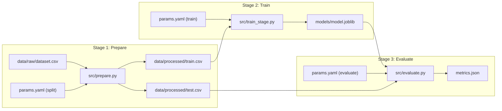

# Phase 6 Plan: A Reproducible DVC Pipeline

**Role Owner:** Model Owner (Assistant)  
**Branch:** `feat/dvc-pipeline` (from `dev`)  
**Target:** 100% End-to-End Reproducibility (`dvc pull && dvc repro` yields identical metrics)

---

## 1. Overview & Stage Architecture



---

## 2. Detailed Pipeline Stages

### Stage 1: `prepare`
* **Script:** `src/prepare.py`
* **Dependencies (`deps`):** `data/raw/dataset.csv`, `src/prepare.py`, `src/data_loader.py`
* **Parameters (`params`):** `seed`, `data.raw_path`, `data.processed_dir`, `data.target_col`, `data.test_size`, `data.random_state`
* **Outputs (`outs`):** `data/processed/train.csv`, `data/processed/test.csv`
* **Responsibilities:**
  - Ingests raw data using relative paths.
  - Strips whitespace from column headers and drops non-predictive metadata (`url`, `timedelta`).
  - Performs fixed-seed train/test split.
  - Exports deterministic CSVs to `data/processed/`.

---

### Stage 2: `train`
* **Script:** `src/train_stage.py`
* **Dependencies (`deps`):** `data/processed/train.csv`, `src/train_stage.py`, `src/features.py`
* **Parameters (`params`):** `seed`, `data.target_col`, `train.model_type`, `train.n_estimators`, `train.max_depth`, `train.random_state`
* **Outputs (`outs`):** `models/model.joblib`
* **Responsibilities:**
  - Loads `train.csv`.
  - Applies domain feature engineering (`create_engagement_features`).
  - Fits preprocessors (`StandardScaler`) **strictly on training split only** to prevent data leakage.
  - Trains model (`RandomForestRegressor`) with fixed seeds.
  - Serializes trained model, scaler, and feature list into `models/model.joblib`.

---

### Stage 3: `evaluate`
* **Script:** `src/evaluate.py`
* **Dependencies (`deps`):** `models/model.joblib`, `data/processed/test.csv`, `src/evaluate.py`
* **Parameters (`params`):** `data.target_col`, `evaluate.metrics_file`
* **Metrics (`metrics`):** `metrics.json`
* **Responsibilities:**
  - Loads `test.csv` and serialized `models/model.joblib`.
  - Transforms test features using the pre-fitted scaler.
  - Computes evaluation metrics: MAE, RMSE, $R^2$.
  - Retrieves current Git commit SHA.
  - Exports `metrics.json` containing metrics, seed, sample counts, hyperparameters, and commit SHA.

---

## 3. Configuration Specifications

### `params.yaml`
```yaml
seed: 42

data:
  raw_path: "data/raw/OnlineNewsPopularity.csv"
  processed_dir: "data/processed"
  target_col: "shares"
  test_size: 0.2
  random_state: 42

train:
  model_type: "random_forest"
  n_estimators: 100
  max_depth: 6
  random_state: 42

evaluate:
  metrics_file: "metrics.json"
```

### `dvc.yaml`
```yaml
stages:
  prepare:
    cmd: python src/prepare.py
    deps:
      - data/raw/dataset.csv
      - src/prepare.py
      - src/data_loader.py
    params:
      - seed
      - data
    outs:
      - data/processed/train.csv
      - data/processed/test.csv

  train:
    cmd: python src/train_stage.py
    deps:
      - data/processed/train.csv
      - src/train_stage.py
      - src/features.py
    params:
      - seed
      - data.target_col
      - train
    outs:
      - models/model.joblib

  evaluate:
    cmd: python src/evaluate.py
    deps:
      - data/processed/test.csv
      - models/model.joblib
      - src/evaluate.py
    params:
      - data.target_col
      - evaluate
    metrics:
      - metrics.json:
          cache: false
```

---

## 4. Verification & Reproducibility Checkpoint

1. Execute `dvc repro` locally to run all three stages end-to-end.
2. Verify `dvc.lock` and `metrics.json` are created/updated.
3. Run `pytest` and `ruff` to ensure 100% test passing and linter compliance.
4. Commit `dvc.yaml`, `dvc.lock`, `params.yaml`, `metrics.json`, and stage scripts to `feat/dvc-pipeline`.
5. Open PR into `dev` with metrics and review checklist.
